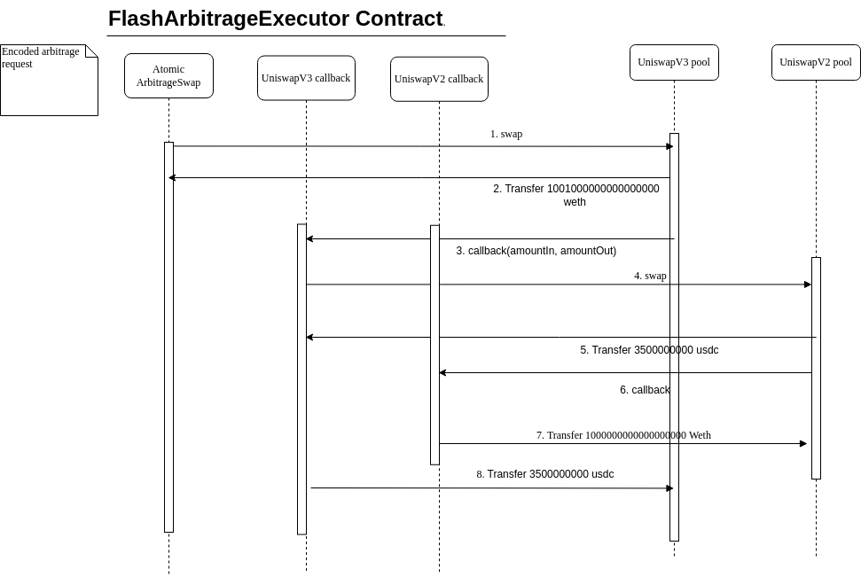

# Atomic Arbitrage Execution

This project is designed to facilitate the execution of single-path atomic arbitrage involving Uniswap V2 and Uniswap V3 pools using flash swaps, all within a single transaction on Ethereum mainnet. The most notable feature of this project is that it allows you to execute arbitrage swaps without requiring any starting capital.

---

## 1. How It Works

Once you detect a favorable arbitrage opportunity involving Uniswap V2 and Uniswap V3 pools, you construct an arbitrage request. This request is encoded into bytes, which are accepted by a smart contract that executes the swap logic on-chain. The execution includes flash swaps, allowing you to leverage liquidity from the pools without an upfront investment.

---

## 2. Project Structure

This project has two major components:
- **Rust Code**: Encodes the arbitrage requests into calldata.
- **Smart Contracts**: Executes the swaps on-chain based on the calldata provided.

---

## 3. Installation

### 3.1: Prerequisites

Ensure you have the following installed:
- **Rust**: For encoding arbitrage requests. [Install Rust](https://www.rust-lang.org/tools/install)
- **Node.js and npm**: For running scripts and deploying/testing contracts. [Download Node.js](https://nodejs.org/)

### 3.2: Installation of Dependencies

#### 3.2.1: Installing Packages/Crates
- **Node.js dependencies**:
 This project uses a monorepo setup between the src and test directories. So installing the packages at the root is sufficient
  ```bash
  cd scripts
  npm install
  ```
- **Rust crates**:
  Run `cargo add` to add necessary crates, or simply run `cargo build` to resolve dependencies.

#### 3.2.2: Source Code
The `src/` directory contains:
- Smart contracts for swap execution and flash swap logic.
- A Hardhat project to deploy and test high-level contract functionality.
- Rust code for encoding arbitrage requests.

#### 3.2.3: Tests
The `test/` directory includes:
- Hardhat test scripts that deploy Uniswap V2 and V3 pools locally to simulate real-world scenarios.
- Scripts to validate the encoding and contract logic.

---

## 4. Running the project

Please open the ```src``` directory for a [detailed description of how to run the project](https://github.com/RC-002/atomic-arbitrage-execution/blob/main/src/README.md)

---

## 5. Testing the project

Please open the ```test``` directory for a [detailed description of how to run the project](https://github.com/RC-002/atomic-arbitrage-execution/blob/main/test/README.md)

---

## 6. High-Level Flow

### 6.1: Off-Chain Logic
1. **Arbitrage Request Creation**:
   - Create an arbitrage request in JSON format, specifying:
     - Input token, output token, and amounts for each hop.
     - The type of pool (e.g., Uniswap V2 or V3) for each hop.
   - Save the request to the `/src/arbitrage-requests` directory.

2. **Encoding Requests**:
   - Run the Rust code to process the arbitrage request:
     ```bash
     cargo run
     ```
   - This reads the requests from `/src/arbitrage-requests`, encodes them, and writes the results to the `/src/arbitrage-encodings` directory (if not a test request).

### 6.2: On-Chain Logic
1. The encoded calldata is passed to the deployed smart contract.
2. The contract processes the calldata in reverse order:
   - It starts with the last hop in the arbitrage path and executes back to the first hop.
   - For each hop, the contract:
     - Receives `token_out` from the pool.
     - Does **not** transfer `token_in` yet but makes the next hop instead.
3. After completing all hops:
   - The contract begins transferring tokens back to the pools as per the stack order.
   - By this time, the surplus tokens are already in the contract, ensuring all pools are paid back.

This reverse execution and stack-based transfer mechanism ensures atomicity and guarantees that no pool is left underfunded.

4. Consider the below Json as the input. This is how the contract would work

---

## 7. Input JSON Format

An arbitrage request should follow this format:
```json
{
  "chain": "mainnet",
  "request": [
                {
                "pool_type": "uniswap_v2",
                "pool_address": "0xB4e16d0168e52d35CaCD2c6185b44281Ec28C9Dc",
                "amount_in": "1000000000",
                "amount_out": "3500000000",
                "token_in": "0xC02aaA39b223FE8D0A0e5C4F27eAD9083C756Cc2",
                "token_out": "0xA0b86991c6218b36c1d19D4a2e9Eb0cE3606eB48"
                },
                {
                "pool_type": "uniswap_v3",
                "pool_address": "0x88e6A0c2dDD26FEEb64F039a2c41296FcB3f5640",
                "amount_in": "3500000000",
                "amount_out": "1001000000000000000",
                "token_in": "0xA0b86991c6218b36c1d19D4a2e9Eb0cE3606eB48",
                "token_out": "0xC02aaA39b223FE8D0A0e5C4F27eAD9083C756Cc2"
                }
              ]
}
```
---

## 9. To-do:

If given more time, I believe the following features would significantly enhance the functionality:

### 1. Verify the Correctness of the Arbitrage Request:
- **Pool Existence Check**:
    - Ensure that the pool with the given address exists on the platform.
- **Token Match Verification**:
    - Call the token0() and token1() methods for the given pool address and confirm that the provided token addresses match the actual tokens in the pool.

### 2. Validate the Feasibility of the Arbitrage Opportunity:
- **Preemptive Arbitrage Check**:
    - Instead of waiting until the final stages to check for arbitrage feasibility, perform a preliminary check earlier in the process to determine if there is a true arbitrage opportunity.
- **Price Quote Validation**:
    - Query the quoter for each pool and check if, for a given amount_in, the resulting amount_out aligns with the expected values based on the current liquidity and market conditions. This will ensure that arbitrage opportunities are genuinely profitable before any gas is spent on executing the transaction.


---

## 10. License

This project is licensed under the MIT License.

---